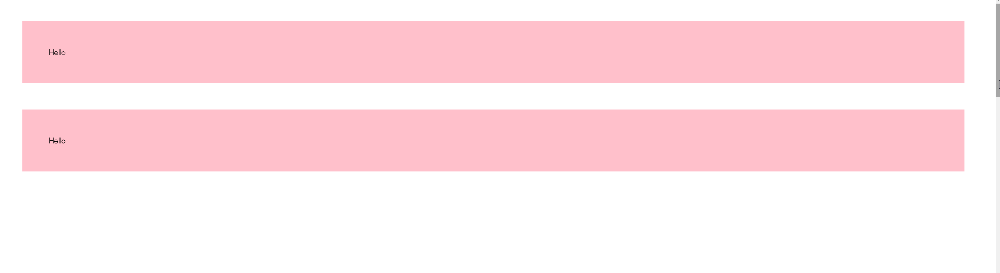
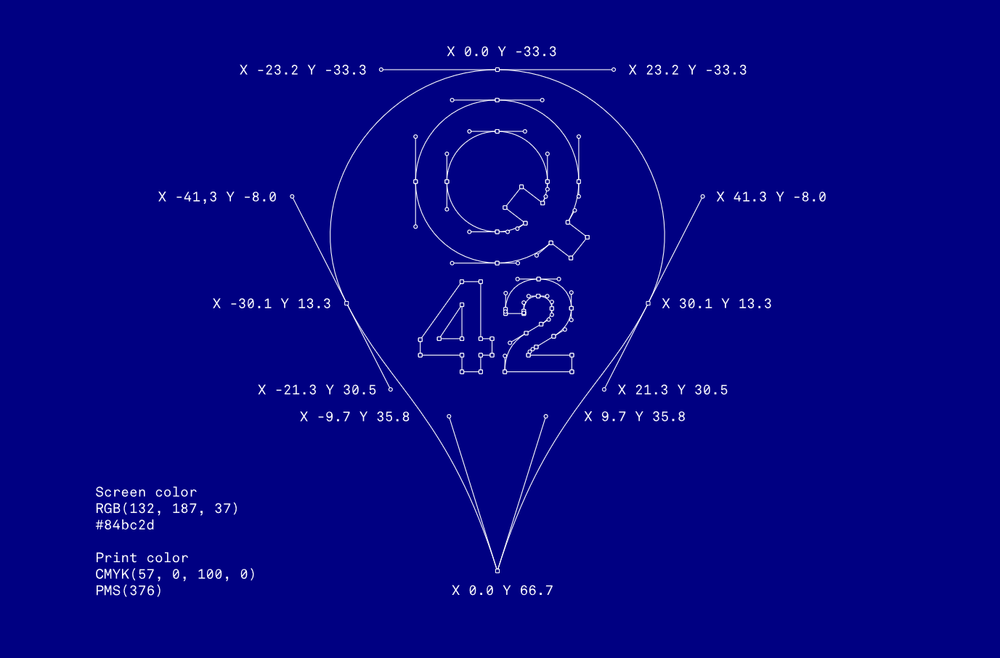

# Q42-Research
Q42 is a beautifull site that used a lot of the latest techniques. This is a research to find out how they do it.
The site is built with [Meteor](http://meteor.com).

## Fade technique:


Every div got a class fading
```javascript
.fading{
    transition: opacity .6s ease;
}
```
There is also a extra selector that put the opacity to 0
```javascript
.fading:not(.visible) {
    opacity: 0;
}
```
After scrolling and the div is above a certain tresshold they added a class: visible to the div
```html
<div class="fading visible"></div>
```
Because the div have the selector *visible* , the selector *.fading:not(.visible)* doesn't apply anymore.

For the checking if the element is in view I don't know for certain how they did, but I think they used Jquery. The user __annalarson__ from codepen showed an example how to do it. You can find it [here](https://codepen.io/annalarson/pen/GesqK)



*javascript example*
```javascript
$(document).ready(function() {
    /* Every time the window is scrolled ... */
    $(window).scroll( function(){

        /* Check the location of each desired element */
        $('.hideme').each( function(i){

            var bottom_of_object = $(this).position().top + $(this).outerHeight();
            var bottom_of_window = $(window).scrollTop() + $(window).height();

            /* If the object is completely visible in the window, fade it it */
            if( bottom_of_window > bottom_of_object ){

                $(this).animate({'opacity':'1'},1500);            
            }    
        });
    });
});
```

## Logo animation

*When hovering over the logo an animation is played*

Src text: http://logo.q42.com/.
The Q42 logo is all bezier curves. The control points and coordinates are in the blueprint below for you to recreate for whatever purpose. The Q42 Green is #84bc2d or PMS 376.


If we look at the html structure we can see that that they used a class 'q42'. This is a custom classed properly created with vue.Js
```html
    <q42 class="q42logo" title="Q42" role="img" aria-label="Q42 Logo">
        <canvas class="fill" width="53" height="80" style="width: 53px; height: 80px;">
        </canvas>
    </q42>
```
This classed is also used to to call the javascript function that will render the the logo

And instead of using the :hover pseudo class, they used javascript to check if the user hover over the element.
```javascript
Q42Logo['webgl-flap'] = function(logo){
	this.logo = logo;
	this.started = 0;
	this.leaving = 0;
};

var proto = Q42Logo['webgl-flap'].prototype = Object.create(Q42Logo.WebGL.prototype);

proto.initModule = function(){
	this.logo.element.addEventListener('mouseenter', this.enter.bind(this));
	this.logo.element.addEventListener('mouseleave', this.leave.bind(this));
};
```

When the user hover over the logo element, this javascript function is triggered.
```javascript
proto.enter = function(e){
	this.started = performance.now();
	this.leaving = 0;
	this.animating = true;
	this.render();
};
```
The function than call the WebGL.js (properly custom written) to animate the Logo
All the source fill can be found on [github](https://github.com/Q42/logo).

## Loading contact asynchronously
When the page is loaded a spinner is displayed


*htlm structure*
```html
    <div class="spinner">
        <div class="svg-holder"></div>
        <div class="svg-holder"></div>
        <div class="svg-holder"></div>
        <div class="svg-holder"></div>
        <div class="svg-holder"></div>
    </div>
```

....More to come....
